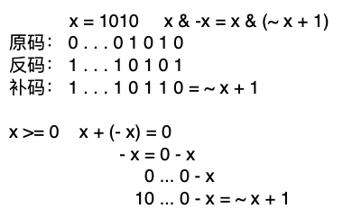

## 801. 二进制中1的个数

#### 题目

给定一个长度为n的数列，请你求出数列中每个数的二进制表示中1的个数。

#### 输入格式
第一行包含整数n。

第二行包含n个整数，表示整个数列。

#### 输出格式
共一行，包含n个整数，其中的第 i 个数表示数列中的第 i 个数的二进制表示中1的个数。

#### 数据范围

```
1≤n≤100000,
0≤数列中元素的值≤10^9
```

#### 输入样例：

```
5
1 2 3 4 5
```

#### 输出样例：

```
1 1 2 1 2
```

#### 题解

##### 位运算

* 求n的第k为数字：`n >> k & 1`
* 返回n的最后一位1：`lowbit(n) = n & -n`
    * 如 1010 -> 10

##### 原理

计算机中负数是以补码表示

 

```go
package main

import (
	"fmt"
	"unsafe"
)

func main() {
	a := int8(-10)
	fmt.Printf("%b\n", *(*[1]byte)(unsafe.Pointer(&a)))
}

// Output:
// [11110110]
```

