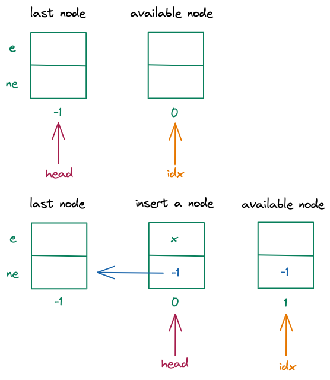

## [826. 单链表](https://www.acwing.com/problem/content/828/)

### 题目

实现一个单链表，链表初始为空，支持三种操作：

1. 向链表头插入一个数；

2. 删除第 k 个插入的数后面的数；

3. 在第 k 个插入的数后插入一个数。

现在要对该链表进行 M 次操作，进行完所有操作后，从头到尾输出整个链表。

**注意:** 题目中第 k 个插入的数并不是指当前链表的第 k 个数。例如操作过程中一共插入了 n 个数，则按照插入的时间顺序，这 n 个数依次为：第 1 个插入的数，第 2 个插入的数，…第 n 个插入的数。

### 输入格式

第一行包含整数 M，表示操作次数。

接下来 M 行，每行包含一个操作命令，操作命令可能为以下几种：

1. H x，表示向链表头插入一个数 x。
2. D k，表示删除第 k 个插入的数后面的数（当 k 为 0 时，表示删除头结点）。
3. I k x，表示在第 k 个插入的数后面插入一个数 x（此操作中 k 均大于 0）。

### 输出格式

共一行，将整个链表从头到尾输出。

### 数据范围

1≤M≤100000
所有操作保证合法。

### 输入样例：

```
10
H 9
I 1 1
D 1
D 0
H 6
I 3 6
I 4 5
I 4 5
I 3 4
D 6
```

### 输出样例：

```
6 4 6 5
```

| 难度：**简单**                                               |
| ------------------------------------------------------------ |
| 时/空限制：1s / 64MB                                         |
| 总通过数：18586                                              |
| 总尝试数：28424                                              |
| 来源：模板题,AcWing                                          |
| 算法标签: [链表](https://www.acwing.com/problem/search/1/?search_content=%E9%93%BE%E8%A1%A8) |

### 题解

数组实现单链表

* head 为头指针，指向链表中的第一个节点
* idx 指针指向当前可以使用的节点 
* e 数组用于存储当前节点的值
* ne 数组用于存储当前节点的next指针

初始状态如下：

-1 指向最后一个节点不存储数值，仅代表链表的结束

整个链表从下标为 0 开始

 