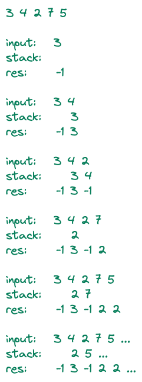

## 830. 单调栈

### 题目

给定一个长度为N的整数数列，输出每个数左边第一个比它小的数，如果不存在则输出-1。

### 输入格式

第一行包含整数N，表示数列长度。

第二行包含N个整数，表示整数数列。

### 输出格式

共一行，包含N个整数，其中第i个数表示第i个数的左边第一个比它小的数，如果不存在则输出-1。

### 数据范围

1≤N≤10^5
1≤数列中元素≤10^9

### 输入样例：

```
5
3 4 2 7 5
```

### 输入样例：

```
-1 3 -1 2 2
```

### 题解

**单调栈**

前提知识：0828. 模拟栈

要求：找出每个数左边第一个比它小的数 input[j]

可以维护一个栈stack，将可能满足要求的值按下标顺序保存在栈中

重要性质：

任取 i < j, stack[i] 必然小于 stack[j],  （反证法）因为若 stack[i] >= stack[j], stack[i]永远无法被取到，因为存在~~比他年轻还比他有钱~~比他的值小却比他更近的 stack[j]。

所以每次找的时候从栈顶向下找即可。例子如下：

栈顶指向0时定义为栈空

 


