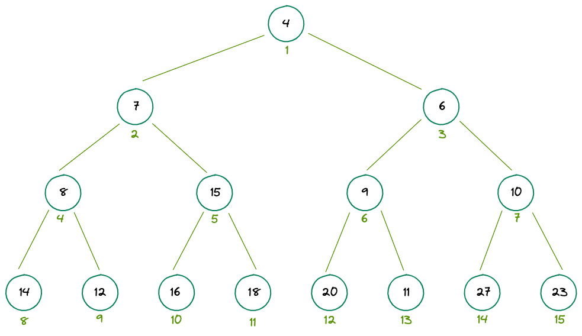
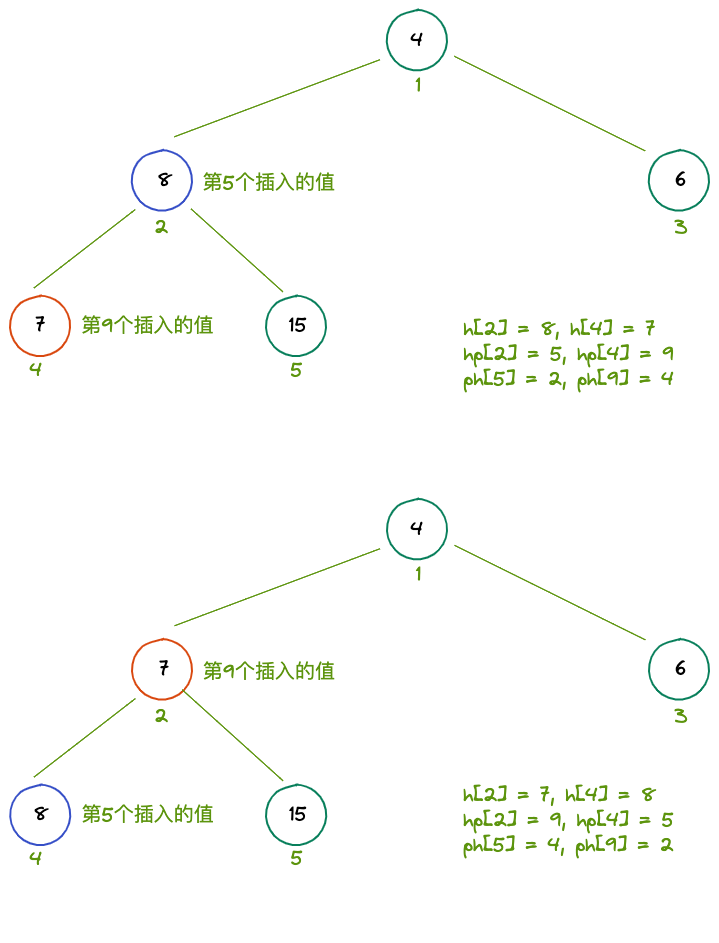

## 839. 模拟堆

### 题目

维护一个集合，初始时集合为空，支持如下几种操作：

1. `I x`，插入一个数 x；
2. `PM`，输出当前集合中的最小值；
3. `DM`，删除当前集合中的最小值（数据保证此时的最小值唯一）；
4. `D k`，删除第 k 个插入的数；
5. `C k x`，修改第 k 个插入的数，将其变为 x；

现在要进行 N 次操作，对于所有第 2 个操作，输出当前集合的最小值。

### 输入格式

第一行包含整数 N。

接下来 N 行，每行包含一个操作指令，操作指令为 `I x`，`PM`，`DM`，`D k` 或 `C k x` 中的一种。

### 输出格式

对于每个输出指令 `PM`，输出一个结果，表示当前集合中的最小值。

每个结果占一行。

### 数据范围

1≤N≤10^5
−10^9≤x≤10^9
数据保证合法。

### 输入样例：

```
8
I -10
PM
I -10
D 1
C 2 8
I 6
PM
DM
```

### 输出样例：

```
-10
6
```

### 题解

#### 堆

#### 小顶堆

任何一个父亲节点比他的两个左右孩子节点都要小

 

#### 数组实现

使用一个数组存储整个堆

堆顶是 1

任意节点下标 `x`，左孩子下标为 `2*x`，右孩子下标为 `2*x+1`

所以很容易通过父节点找到子节点，反之亦然

#### 堆的操作

1. 建堆

    时间复杂度为 O(n)

    如图所示，最后一行的 n/2 个节点无需下沉，倒数第二行的 n/4 个节点最多需下沉 1 次，倒数第三行的 n/8 个节点最多需下沉 3 次……

    n/2 * 1 + n/4 * 2 + n/8 * 3 + ...

    n * (收敛半径为 1 的幂级数) 所以时间复杂度为 O(n)

2. down：通过节点下沉满足堆的性质

3. up：通过节点上升满足堆的性质

4. 删除第 k 个插入的数

    需要新开两个数组 hp 和 ph，

    ph: 第 k 个插入到数组下标的映射

    hp: 数组下标到第 k 个插入的映射

    ph 用于在删除时找到数组下标

    hp 用于在 down 或 up 的操作时找到是第 k 个插入的指针，并更新指向

 