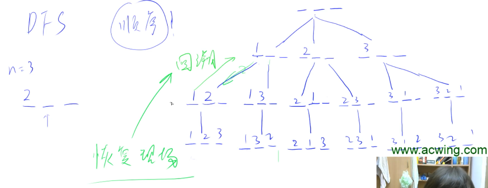

## 842. 排列数字

### 题目 

给定一个整数n，将数字1~n排成一排，将会有很多种排列方法。

现在，请你按照字典序将所有的排列方法输出。

### 输入格式

共一行，包含一个整数n。

### 输出格式

按字典序输出所有排列方案，每个方案占一行。

### 数据范围

1≤n≤7

### 输入样例：

```
3
```

### 输出样例：

```
1 2 3 
1 3 2 
2 1 3 
2 3 1 
3 1 2 
3 2 1 
```

### 题解

使用dfs

